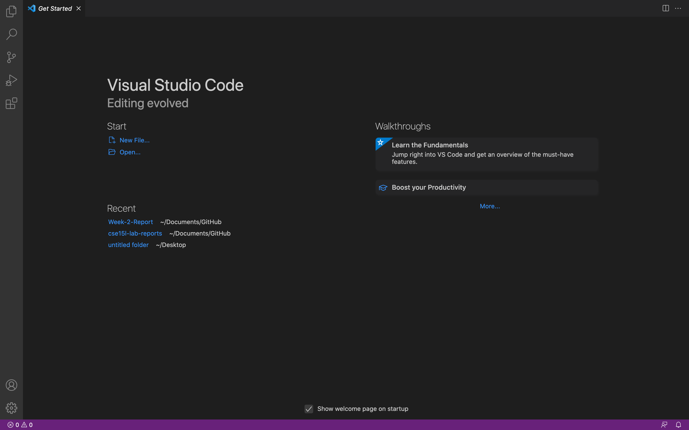
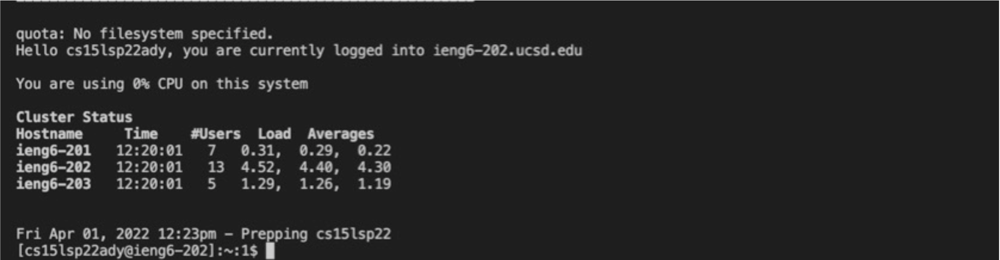
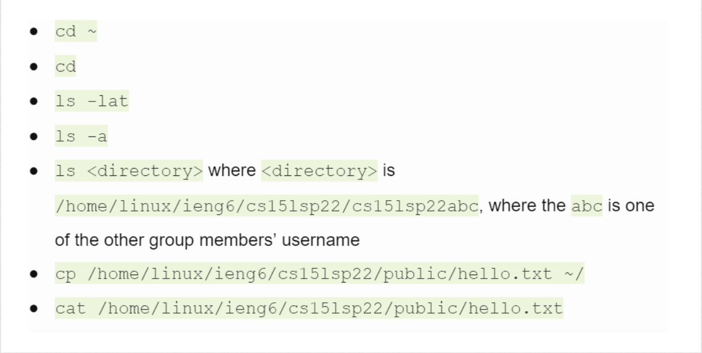
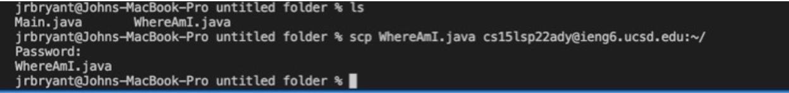
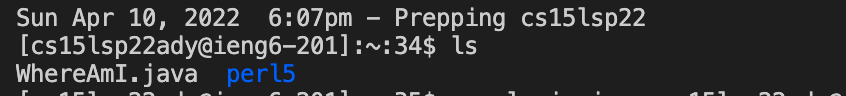
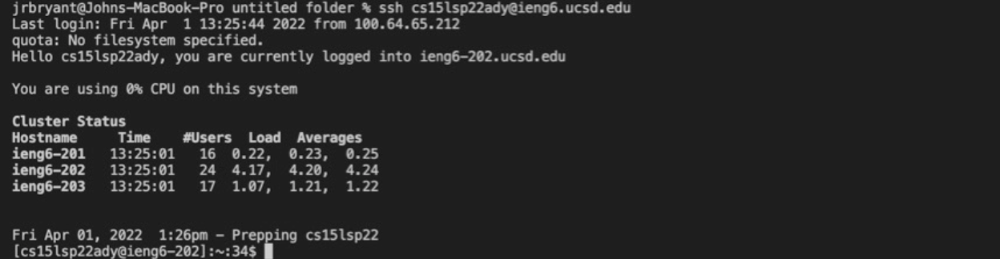
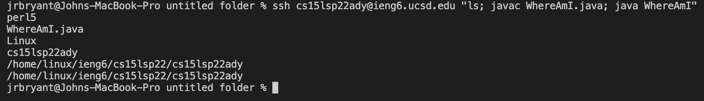

# Logging into **ieng6** with a course specific account
---
## 1. Installing VScode
- Download VScode from the following link, and make sure to choose your system's operation system

- - ## [VScode download link](https://code.visualstudio.com/download)

- When the download is complete,run the application, you should then be greeted with a screen like this

---
## 2. Remote Connecting
- To remote connect you need to install [OpenSSH](https://docs.microsoft.com/en-us/windows-server/administration/openssh/openssh_install_firstuse) from this link.
- You would also need to find your course specific information from this [Link](https://sdacs.ucsd.edu/~icc/index.php).

- - **The three letters will be your username in this format, Examples being: abc, ady, aki**
- - `cs15lsp22(account name)@ieng6.ucsd.edu`

- Afterthat, go to VScode to login into the remote server.
- When prompted to put your password, put in your ucsd password that you should have reset before the course.

- You should then see a screen like this:

---
## 3. Typing Some Commands

- Try out some commands shown in the picture below

- These commands are essential to understand how your local server, and the remote server work together.
---
## 4. Moving Files with SSP
- You could move a file from your local server to the remote one using this code:
- - `scp fileName.java cs15lsp22(account name)@ieng6.ucsd.edu:~/`
- After signing in again using **ssh**, you could check for the file in the remote server with the `ls` command.
- This is how it should look when you copy it:

- Checking it with the `ls` command should look like this:

---
## 5. Setting up the SSH key
- Setting a key helps to save time by having your password automatically be put into the server when you log in.
- To start, run this command in your terminal
- - `ssh-keygen`
- Save the key, and then proceed by **ENTERING NOTHING FOR THE PASSPHRASE**
- You then want to log in, and then log out, when logged out enter this code:
- - `scp /Users/<user-name>/.ssh/id_rsa.pub cs15lsp22(account name)@ieng6.ucsd.edu:~/.ssh/authorized_keys`
- After entering your password following the previous code, you should then proceed to login in.
- With the ssh key, you should now not need to input a password, as shown in the image below:

---
## 6. Optimzing Remote Running
- You could run multiple commands at once, if you put then after each other.
- - Example: 
`scp WhereAmI.java cs15lsp22ady@ieng6.ucsd.edu:~/;`

- - `ssh cs15lsp22ady@ieng6.ucsd.edu "ls; javac WhereAmI.java; java WhereAmI"`

- These lines of code would copy `WhereAmI.java` into your remote server, and then run that code in the remote server.

- Here is an image displaying this process:

